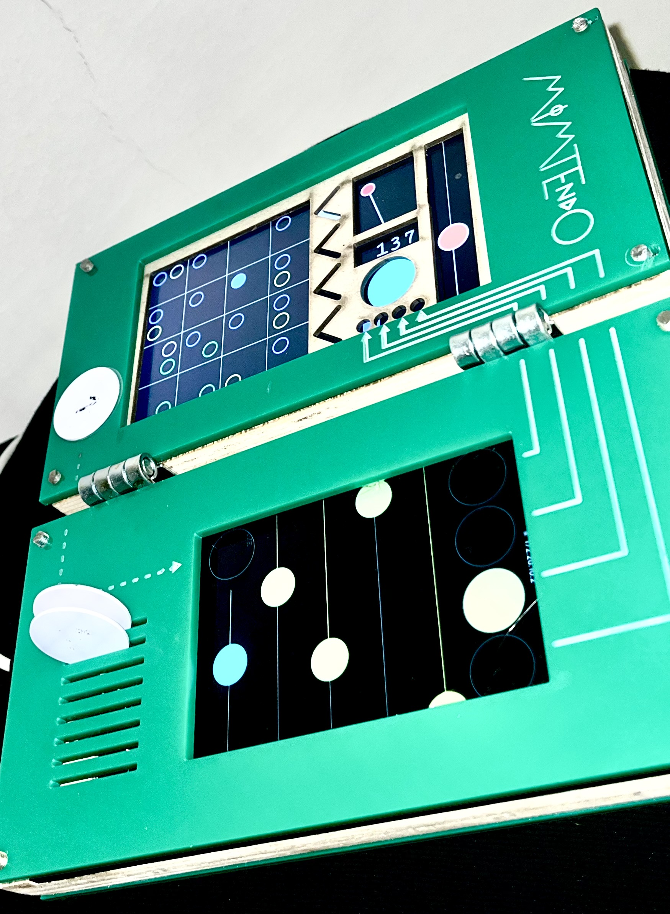

# MIMTEndO: Musical Instrument Made To END Obsolescence

MIMTEndO is a musical instrument made from a combination of obsolete smartphones. It is part of a research project aimed at exploring how, by combining several old and broken devices and using high-level web technologies, it is possible to create new interactive interfaces
in order to extend their lifespan.

MIMTEndO is an experimental prototype, somewhere between a toy and a musical instrument, that allows users to explore different interactive modalities offered by sensors integrated into smartphones, under the constraints of their computing power and general condition.

This prototype is a continuation of the work on [Zombitron](https://arxiv.org/abs/2508.06354) presented at the LIMITS conference in June 2025. In this article, I described how a tool based on a combination of obsolete smartphones can be used to design interactive systems with a high-level approach, with the aim of promoting the reuse of smartphones for a non-expert computer audience.

MIMTEndO comes in the form of an articulated box containing two smartphones with different operating systems and ages that are still functional but have fallen victim to software obsolescence.

The instrument allows you to compose 16 steps sequences with 4 instruments that can me modulated with 4 different filters and effects. 
Each sequence and sound can be recorded on a customizable card equipped with an NFC chip and loaded into the box like a cartridge in a console.

## Install
git clone with submodules flag --recurse-submodules

npm install

follow instructions in terminal 

npm run start